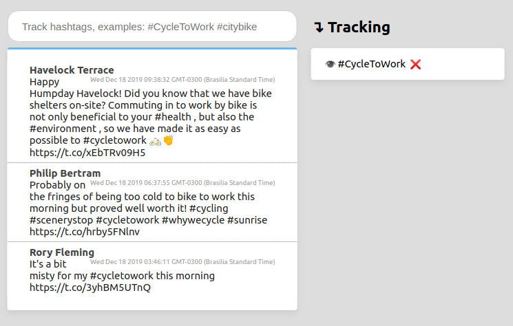

# 🐻🐦 HashtaGO Stalker!


>_Disclaimer: This is my first time writing **Go**, therefore some design decisions were limited due my unfamiliarity with the language, e.g. didn't get to use Go modules or packages._

HashtaGO is a small webapp that tracks Twitter's tweets in real time under user-specified hashtags.
The app is composed of a RESTful backend API and a minimalistic what gets-the-job-done VanillaJS frontend.

Due the project's scope, constraints and my inexperience with golang, no work was put into using a database or security (`/api/` routes shouldn't be visible to the frontend user).

Still the project is not unstructured, it tries to divide the system into three major components: `Stalker API`, `Tweet Stream` and `Tweet Storage`.
Each component is written to be minimal and responsible for a single class of tasks, i.g. the stream is responsible for receiving tweets from the Twitter API, which are then sent through go channels to the `Tweet Storage` for storing tweets and allowing internal components to access them from the storage.
`Stalker API` is exclusively responsible for managing the backend API to interact with the frontend system.

## Installing
Clone the repository into your `$GOPATH`. While inside the repository run
`go build` to build the `hashtago-stalker` executable.

To run the program, first do the `environment setup` and execute the executable generated:
```
./hashtago-stalker
```

## Environment setup
The program needs two environment variables to be set, `TWITTER_CONSUMER_KEY` and `TWITTER_CONSUMER_SECRET`.
This can be done in _bash/zsh/any-bash-syntax_:
```
export TWITTER_CONSUMER_KEY=your_consumer_key_here
export TWITTER_CONSUMER_SECRET=your_cool_consumer_secret_here
```
Or if you are one of the cooler kids, you can do it in _fish_ like this:
```
set -x TWITTER_CONSUMER_KEY    your_beautiful_consumer_key_here
set -x TWITTER_CONSUMER_SECRET your_wonderful_consumer_secret_here
```
Optionally you can also set the server port through the env variable `PORT`, otherwise it will default to the port `3000`.


## Known issues
- 🐤

## Future improvements
- Add tests. Due my lack of experience with Go and the diversity of tweet data to be mocked, writing tests isn't trivial